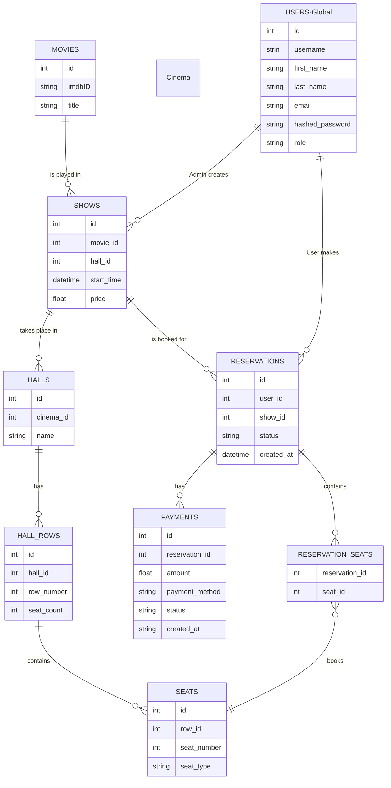

# Cinema-Ticket-Reservation-System
 A project for design exercises in distributed systems that will create a cinema ticket reservation system.

```mermaid
erDiagram
    USERS-Global {
        int id
        strin username
        string first_name
        string last_name
        string email
        string hashed_password
        string role
    }

    Cinema {

    }
    
    HALLS {
        int id
        int cinema_id
        string name
    }
    
    HALL_ROWS {
        int id
        int hall_id
        int row_number
        int seat_count
    }
    
    SEATS {
        int id
        int row_id
        int seat_number
        string seat_type
    }
    
    MOVIES {
        int id
        string imdbID
        string title
    }
    
    SHOWS {
        int id
        int movie_id
        int hall_id
        datetime start_time
        float price
    }
    
    RESERVATIONS {
        int id
        int user_id
        int show_id
        string status
        datetime created_at
    }
    
    RESERVATION_SEATS {
        int reservation_id
        int seat_id
    }
    
    PAYMENTS {
        int id
        int reservation_id
        float amount
        string payment_method
        string status
        string created_at
    }

    %% Relationships
    USERS-Global ||--o{ RESERVATIONS : "User makes"
    RESERVATIONS ||--o{ RESERVATION_SEATS : "contains"
    RESERVATION_SEATS }o--|| SEATS : "books"
    RESERVATIONS ||--o{ PAYMENTS : "has"
    HALLS ||--o{ HALL_ROWS : "has"
    HALL_ROWS ||--o{ SEATS : "contains"
    MOVIES ||--o{ SHOWS : "is played in"
    SHOWS ||--o{ RESERVATIONS : "is booked for"
    SHOWS ||--o{ HALLS : "takes place in"
    USERS-Global ||--o{ SHOWS : "Admin creates"

    %% ENUM Descriptions (Mermaid does not support enums natively)
    %% Role: admin, staff, customer
    %% Seat Type: standard, premium, VIP
    %% Status (Reservations): reserved, paid, canceled
    %% Payment Method: card, cash, online
    %% Payment Status: pending, completed, failed
```